# **🚀 Develop-Driven Release Framework** 
[[versão pt-br]](README_pt-br.md)

A professional-grade automated workflow for modern software delivery. This framework implements a **Dual-Branch Strategy** designed to decouple development noise from production stability using GitHub Actions.

## **📖 Table of Contents**

1. [Architecture Overview](#-architecture-overview)
2. [Project Structure](#-project-structure)
3. [The Workflow (DDR Logic)](#-the-workflow-develop-driven-release)
4. [Automation Features](#-automation-features)
5. [Changelog Preview](#-changelog-preview)
6. [Quick Start](#-quick-start)

## **🏛️ Architecture Overview**

The **Develop-Driven Release Framework** is a language-agnostic engine designed to enforce **Semantic Versioning (SemVer)** without manual overhead. It treats your documentation and infrastructure-as-code (Ansible, Terraform) with the same rigor as application code.

### **The Branch Strategy**

* `develop` **(The Engine Room)**: All active development happens here. It triggers automated Pull Requests and accumulates atomic changes.  
* `main` **(The Showroom)**: Represents the "Stable" state. It only receives code via PRs from develop. Every push to main triggers a new version calculation and a formal release.

## **📂 Project Structure**
```
develop-driven-release/  
├── 📂 .github/  
│   └── 📂 workflows/  
│       ├── ⚙️ develop-automation.yml  
│       └── ⚙️ release-automation.yml  
├── 📄 version.yml  
├── 📄 README.md  
├── 📄 CONTRIBUTING.md  
└── 📄 LICENSE
```

## **🔄 The Workflow (Develop-Driven Release)**

The system operates on a constant cycle between two main branches:

```mermaid
sequenceDiagram
    participant Dev as 💻 Developer
    participant Develop as 🌿 Develop Branch
    participant PR as 🚀 Pull Request
    participant Main as 🏛️ Main Branch
    participant Bot as 🤖 Develop-Driven<br>Release Engine (Actions)

    Dev->>Develop: Atomic Commits<br>(chore, feat, docs)
    Develop->>PR: Auto-creates/updates PR
    PR-->>Dev: Review & Approval
    Dev->>PR: Reviewed & Approved
    PR->>Main: Merge to Main
    Main->>Bot: Triggers Release
    Bot-->>Bot: Calculates SemVer & Tags v1.0.0
    Bot->>Main: Generates Changelog<br>& Bump Version
    Bot-->>Develop: Sync Back (Back-merge stable version)
```



## **✨ Automation Features**

* **Automated SemVer**: Versioning is calculated based on commit intent (feat:, fix:, perf:).  
* **Smart Back-merge**: Keeps your **develop** branch always in sync with production metadata.  
* **SSOT (Single Source of Truth)**: Centralizes version control in version.yml.  
* **Tool-Agnostic**: Designed for Ansible, Terraform, Python, or Web projects.

## **📝 Changelog Preview**

This is how the system automatically documents your progress:

```
# Changelog

## [1.1.0] - 2026-01-11
### 🚀 Features
- **auth:** implement new login flow with JWT
- **api:** add endpoints for user profile management

### 🛠️ Bug Fixes
- **security:** fix bypass in middleware validation
```

## **🚀 Quick Start**

### **1. Requirements**

* Adherence to [Conventional Commits](https://www.conventionalcommits.org/en/v1.0.0/).


### **2. Option A: Use as Template (Recommended)**

1. Click the **"Use this template"** button at the top of this repository. 
2. Click on **"Create a new repository"** option.
3. Toggle OFF the **"Include all branches"** option.
4. Set a name and **"Create Repository"**.
5. Check GitHub will create a fresh repository for you.
6. Go to **Settings \> Actions \> General**.  
7. Select **"Read and write permissions"**.  
8. Check **"Allow GitHub Actions to create and approve pull requests"** and Save.
9. Follow this steps on your local machine:
```
# Clone your new repository
git clone https://your-url-repo.git

# Create a new branch develop
cd your-repo-folder-name
git checkout -b develop
```
10. On `develop` branch, start committing you job.
11. Finally, make a push `git push -u origin develop`.
12. Check GitHub Actions will start the workflow.
13. A new PR will be pending for an approval on GitHub.
14. If you approve some PR with `feat:`, `fix:` or `BREAKING CHANGE:` commits, a new release, a new tag and the CHANGELOG.md will be created/updated, followed by a back-merge of bump version to the `develop` branch.
15. Remember to pull `main` and `develop` branches on your local machine.
16. New changes? Go back to step 10 and keep pushing!
 

### **3. Option B: Manual Clone & Setup**
1. Create a new repository for you with no templates.
2. Go to **Settings \> Actions \> General**.  
3. Select **"Read and write permissions"**.  
4. Check **"Allow GitHub Actions to create and approve pull requests"** and save.
5. Follow this steps on your local machine:
 ```
# Clone the Develop-Driven Release Repository  
git clone https://this-source-url-repo.git
cd develop-driven-release

# Point it to your own project repository  
git remote set-url origin https://your-url-repo.git

# Establish your branch baseline on GitHub  
git checkout main  
git push -u origin main  
git checkout -b develop  
```
6. On `develop` branch, start committing you job.
7. Finally, make a push `git push -u origin develop`.
8. Check GitHub Actions will start the workflow.
9. A new PR will be pending for an approval on GitHub.
10. If you approve some PR with `feat:`, `fix:` or `BREAKING CHANGE:` commits, a new release, a new tag and the CHANGELOG.md will be created/updated, followed by a back-merge of bump version to the `develop` branch.
11. Remember to pull `main` and `develop` branches on your local machine.
12. New changes? Go back to step 6 and keep pushing!

## **⚖️ License**

Licensed under the **Apache License 2.0**. See [LICENSE](LICENSE) for details.