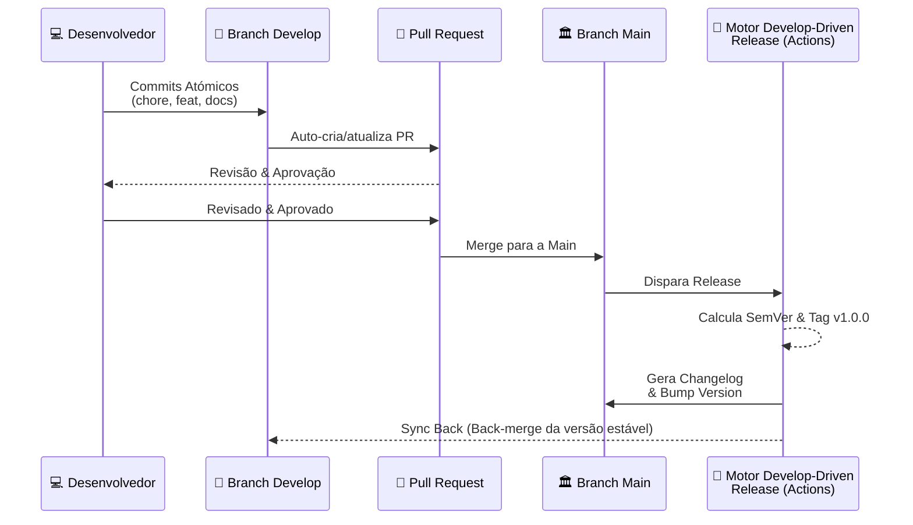

## 🇧🇷 Versão em Português (PT-BR)

# **🚀 Develop-Driven Release Framework**

Um workflow de automação de nível profissional para entrega de software moderna. Este framework implementa uma estratégia de **Dual Branches** projetada para desacoplar o ruído do desenvolvimento da estabilidade da produção utilizando GitHub Actions.

## 📖 **Sumário**

1. [Visão Geral da Arquitetura](#-visão-geral-da-arquitetura)
2. [Estrutura do Projeto](#-estrutura-do-projeto)
3. [Workflow (Lógica DDR)](#-o-workflow-develop-driven-release)
4. [Features de Automação](#-features-de-autoamação)
5. [Exemplo de Changelog Gerado](#-exemplo-de-changelog-gerado)
6. [Início Rápido](#-início-rápido)


## **🏛️ Visão Geral da Arquitetura**

O **Develop-Driven Release Framework** é um motor agnóstico de linguagem projetado para aplicar **Semantic Versioning (SemVer)** automaticamente. Ele trata documentação e infraestrutura como código (Ansible, Terraform) com o mesmo rigor que código de aplicação.

### **Estratégia de Branches**

* `develop` **(Sala de Máquinas)**: Onde o desenvolvimento acontece. Dispara PRs automáticos.  
* `main` **(Vitrine)**: Estado estável. Recebe código apenas via PRs da develop. Cada push gera uma nova versão.

## **📂 Estrutura do Projeto**

```
develop-driven-release/
├── 📂 .github/
│   └── 📂 workflows/
│       ├── ⚙️ develop-automation.yml
│       └── ⚙️ release-automation.yml
├── 📄 version.yml
├── 📄 README.md
├── 📄 CONTRIBUTING.md
└── 📄 LICENSE
```

## **🔄 O Workflow (Develop-Driven Release)**

O sistema opera em um ciclo constante entre duas branches principais:


## **✨ Features de Automação**

* **SemVer Automatizado**: O versionamento é calculado com base na intenção do commit (`feat:`, `fix:`, `perf:`).
* **Back-merge Inteligente**: Mantém a sua branch **develop** sempre sincronizada com os metadados de produção.
* **SSOT (Fonte Única da Verdade)**: Centraliza o controle de versão no arquivo `version.yml`.
* **Agnóstico**: Projetado para projetos em Ansible, Terraform, Python ou Web.

## **📝 Exemplo de Changelog Gerado**

É assim que o sistema documenta automaticamente o seu progresso:

```text
# Changelog

## [1.1.0] - 2026-01-11
### 🚀 Features
- **auth:** implement new login flow with JWT
- **api:** add endpoints for user profile management

### 🛠️ Bug Fixes
- **security:** fix bypass in middleware validation
```

## **🚀 Início Rápido**

### **1. Requisitos**

* Aderência ao padrão [Conventional Commits](https://www.conventionalcommits.org/en/v1.0.0/).

### **2. Opção A: Usar como Template (Recomendado)**

1.  Clique no botão **"Use this template"** no topo deste repositório.
2.  Clique na opção **"Create a new repository"**.
3.  **Desmarque (Toggle OFF)** a opção **"Include all branches"**. Isso garante que o histórico comece limpo a partir da `main`.
4.  Defina um nome e clique em **"Create Repository"**.
5.  Veja que o GitHub criará um repositório novo para você.
6.  Vá em **Settings \> Actions \> General**.
7.  Selecione **"Read and write permissions"**.
8.  Marque **"Allow GitHub Actions to create and approve pull requests"** e clique em Save.
9.  Siga estes passos na sua máquina local:
```
# Clone o seu novo repositório
git clone https://url-do-seu-repo.git

# Entre na pasta do projeto
cd nome-da-pasta-do-seu-repo

# Crie uma nova branch develop a partir da main
git checkout -b develop
```
10.  Na branch `develop`, comece a fazer os commits do seu trabalho.
11.  Por fim, faça um push: `git push -u origin develop`.
12.  Verifique que o GitHub Actions iniciará o workflow automaticamente.
13.  Um novo PR ficará pendente para aprovação no GitHub.
14.  Se você aprovar um PR com commits do tipo `feat:`, `fix:` ou `BREAKING CHANGE:`, uma nova release, uma nova tag e o arquivo `CHANGELOG.md` serão criados/atualizados, seguidos de um back-merge da bump version para a branch `develop`.
15.  Lembre-se de fazer `pull` das branches `main` e `develop` na sua máquina local após o merge.
16.  Novas alterações? Volte ao passo 10 e continue o ciclo!
    

### **3. Opção B: Clone Manual e Configuração**
1.  Crie um novo repositório para você no GitHub (sem utilizar templates).
2.  Vá em **Settings \> Actions \> General**.
3.  Selecione **"Read and write permissions"**.
4.  Marque **"Allow GitHub Actions to create and approve pull requests"** e clique em Save.
5.  Siga estes passos na sua máquina local:
```
# Clone o repositório original do Develop-Driven Release
git clone https://url-deste-repo.git
cd develop-driven-release

# Mude a URL do (remote) para o seu próprio repositório
git remote set-url origin https://url-do-seu-repo.git

# Estabeleça a base das suas branches no GitHub
git checkout main
git push -u origin main
git checkout -b develop
```
6.  Na branch `develop`, comece a fazer os commits do seu trabalho.
7.  Finalmente, faça um push: `git push -u origin develop`.
8.  Verifique que o GitHub Actions iniciará o workflow.
9.  Um novo PR ficará pendente para aprovação no GitHub.
10. Se você aprovar um PR com commits do tipo `feat:`, `fix:` ou `BREAKING CHANGE:`, uma nova release, uma nova tag e o arquivo `CHANGELOG.md` serão criados/atualizados, seguidos de um back-merge da bump version para a branch `develop`.
11. Lembre-se de fazer `pull` localmente para sincronizar as branches `main` e `develop`.
12. Novas alterações? Volte ao passo 6 e continue o ciclo!

## **⚖️ Licença**

Licenciado sob a **Apache License 2.0**. Consulte o arquivo [LICENSE](LICENSE) para mais detalhes.